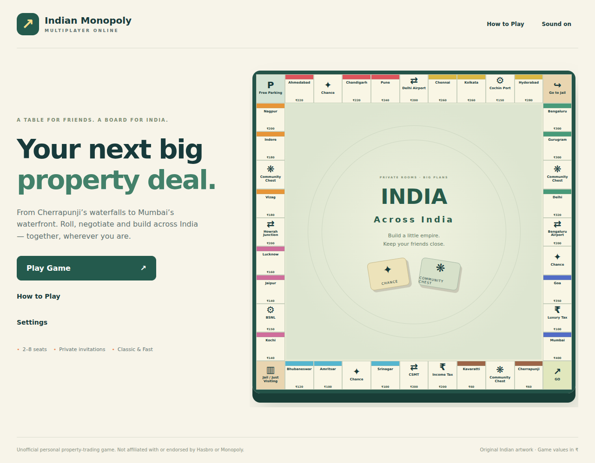
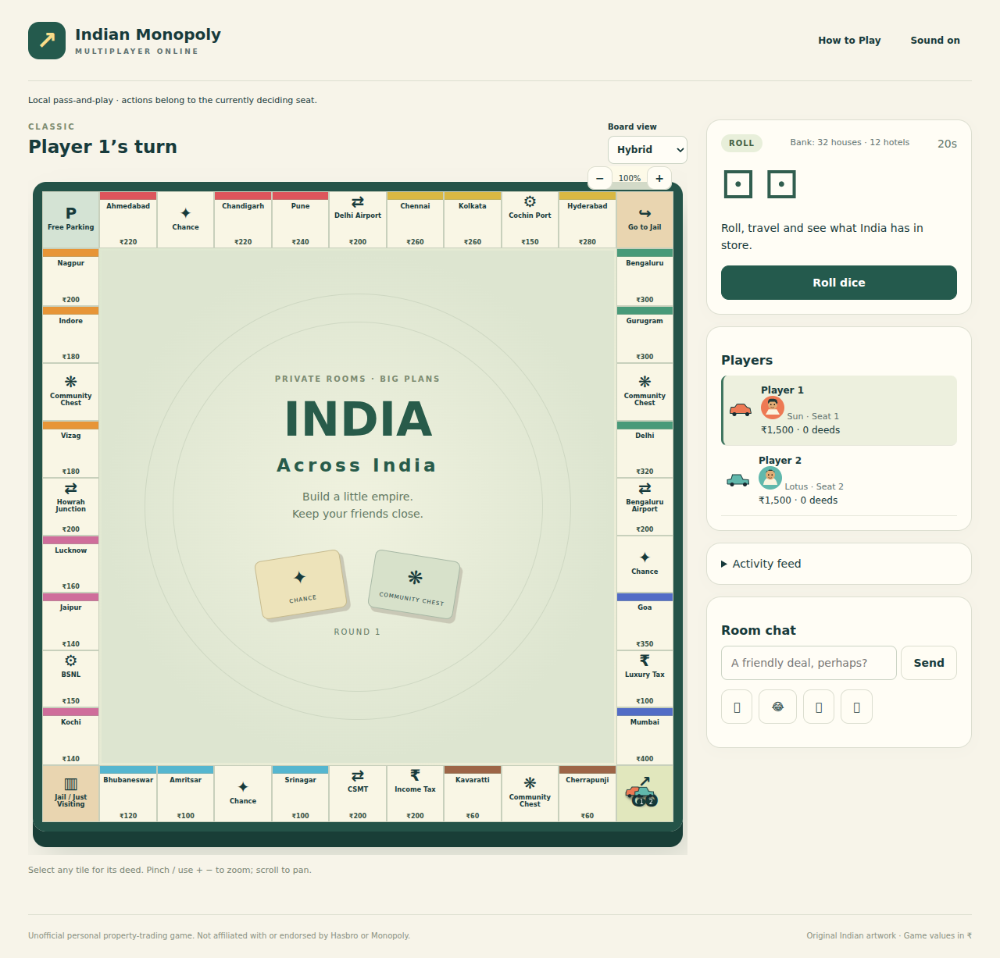
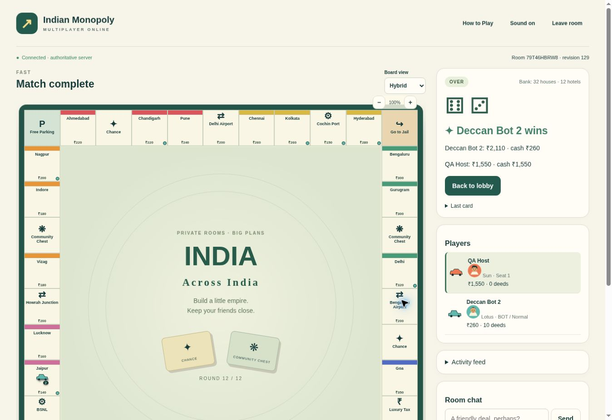

# Indian Monopoly Multiplayer Online

An unofficial, private-room property-trading game for friends, with an Indian board, Classic and Fast games, paired teams, heuristic bots and local pass-and-play. All money is fictional game money. No accounts, public matchmaking, purchases, analytics or runtime AI service are used.

**Delivery status: live, with core online flows verified.** Production is available at [indian-monopoly-multiplayer-online.vercel.app](https://indian-monopoly-multiplayer-online.vercel.app).

## Product and content

The 40-space square board has 22 cities in eight colour groups, four transport deeds, two utilities, six card spaces, two taxes and four corners. Visakhapatnam, Cherrapunji, Kavaratti, Srinagar and major cities provide broad geographic coverage. Colour groups describe fictional game prestige, not factual city rankings. Full prices, six-level city rents, mortgages, building costs, transport tiers and utility multipliers live in `src/content/board.ts`.

Transport defaults are Chhatrapati Shivaji Maharaj Terminus, Howrah Junction, Delhi airport and Bengaluru airport. New Delhi and Chennai Central remain data alternatives. Utilities are plain-text BSNL and Cochin Port Authority, with generic artwork and no logos or endorsement claims. Real organisations are fictional game holdings.

There are 20 original SVG token families with icon/shaded/model presentation choices, extruded lightweight 3D pieces, eight original avatars, seat colours and BOT badges. Three licensed city photographs supplement original SVG art for every city. All board modes consume the same authoritative state; Three.js loads only when Actual 3D is selected. The flat view also serves as the WebGL fallback.

Default settings: Classic, ₹1,500 per seat, capacity four, free-for-all, auctions/mortgages/even building enabled, group-build controls enabled, 20-second roll timer and hybrid presentation. Capacity is 2–8; at least one human is required in public setup. Roll timers are 20/30/60 seconds. Fast defaults to 12 rounds for two seats, eight for 3–4, six for 5–6 and five for 7–8; hosts can choose 5–20. Settings lock at start.

## Rules and deliberate extensions

Baseline: Hasbro/Parker Brothers **40009-I-Rev 2**, [official rulebook PDF](https://www.hasbro.com/common/instruct/monins.pdf). Original descriptions and card writing are used. Purchases, doubles, GO salary, Jail exits, transport/utility rent, even construction, finite 32-house/12-hotel stock, mortgages and insolvency follow the classic structure. Unmortgaged undeveloped members retain doubled set rent even if another member is mortgaged. Mortgage transfers require immediate interest, with another interest payment for deferred redemption. Held release cards stay out of the cyclic deck until returned. No Free Parking jackpot, loans or negative completed balances are permitted.

Digital extensions and deviations:

- Automatic rent replaces the physical rule's claim deadline. The starting turn follows lobby order rather than a separate opening dice contest.
- Income Tax offers ₹200 or 10% of cash, printed deed prices and full building investment. Luxury Tax is ₹100, an explicit modern-value deviation from the older physical edition. Fractional interest/tax is rounded upward to a whole rupee to preserve integer accounting.
- Portfolio changes and negotiated trades are restricted to the current seat's roll/Jail/management windows, or the liable account's debt phase, rather than arbitrary interruption of another player's physical turn. Mandatory decisions resolve atomically before advancement.
- Timed property auctions use sequential six-second responses, minimum ₹1 raises, binding affordable bids and permanent passes. A decline or expired buy decision starts an auction if enabled. When remaining building stock is contested, eligible accounts choose their own legal placement or decline on a six-second deadline. Excess demand uses the same auction engine; stock and placement legality are checked on award. Group-build shortcuts cannot bypass scarce supply.
- Buying/ordinary management expires after 20 seconds; offered trades after 30 seconds; flagged trade review after 10 seconds; debt after 60 seconds. Missing a roll skips the opportunity; debt timeout legally liquidates before insolvency. Timers cannot be paused by animations or a closed host tab.
- Trades include deeds, cash and held release cards, with incoming counters, immediate mortgage-redemption selections, revalidation and atomic transfer. Pure cash gifts are rejected. Estimated value imbalance above 4:1 requires both confirmations and a strict majority objection window for connected uninvolved humans. One vote per uninvolved team is counted. This cannot prevent outside coordination.
- A solvent forfeit settles an existing creditor obligation first and returns remaining assets to bank auctions. Insolvency transfers assets through creditor bankruptcy rules. Removed credentials are revoked; a new device cannot be perfectly identified in a guest-only game.
- Fast finishes complete scheduled rounds after obligations settle. Net worth is cash + printed deed prices − mortgage principal + half building investment. A hotel represents five building purchases. Ties compare cash, then total printed deed value, then share victory. Release cards carry no score.

The original Chance/Community Chest decks contain 16 cards each, covering travel, trains, UPI, cricket, weddings, monsoon, startups, society bills, family gifts and festivals across communities. Effects include chained movement, special transport/utility landings, repairs, payments, Jail and transferable release cards. Future deck order is never published.

### Teams and bots

Teams are a custom extension: 2–4 pairs, interleaved turns, individual token/Jail/doubles state, and shared cash/deeds/release cards. Starting team cash is twice the seat amount. Team holdings determine rent and sets; no intra-team rent/trade is needed. The earliest-joined active seat is the designated trade and auction responder, with a connected teammate fallback. One forfeiting member leaves the team portfolio intact; shared insolvency eliminates the account and both members.

Easy, Normal, Hard and Expert bots use bounded heuristics and the same validated commands as humans. Difficulty changes reserves, valuation, auction limits, set completion, blocking, building ROI and trade thresholds; harder bots adjust for opposing rent exposure and the final Fast round. They do not inspect decks or future dice. Proactive bot offers are not enabled. Public AI-only setup is rejected; seeded bot-only fixtures are internal tests.

## Architecture and security

- `src/engine`: pure deterministic transitions, integer accounting, invariant checks and bot decisions. Randomness and clock inputs are supplied by the adapter.
- `src/content`: typed board/cards, token configuration and asset manifest.
- `convex`: transactional room mutations, subscription queries, durable scheduled deadlines/bots, presence, votes, expiry and rate-limit cleanup. The database owns online state; Vercel processes and browsers do not retain authoritative rooms.
- `src/app/api/room/route.ts`: same-origin intent gateway, strict runtime validation, bounded payloads and server-only shared gateway authentication.
- `src/components`: lobby/deeds/trading/chat, flat/hybrid board and lazy actual WebGL board. Event IDs prevent reconnect replay; movement is cosmetic.

An unguessable HttpOnly SameSite=Strict cookie, Secure in production, identifies the room-bound guest. Only its hash is passed to the backend. A separate five-minute read token stays in client memory for subscription access; it cannot mutate. The credential expires at 24 hours and can be revoked. Copying a name/code cannot reclaim a seat. Server-side randomness, revision checks, atomic transactions and per-seat command IDs prevent client-forged outcomes and duplicate effects. Retried commands preserve the same ID; stale revisions are rejected for reconciliation.

Invitations disclose only high-entropy room codes. Decks and session secrets are removed from snapshots. Chat is escaped text and has a per-seat rate limit. Entry, heartbeat, action and voting limits are enforced in durable mutations. Production requires an exact `APP_ORIGIN`; branch-preview online mutations are disabled pending isolated backend configuration.

## Lifetime and recovery

No match-save library is provided. Active rooms expire at 24 hours; fully empty abandoned rooms at ten minutes; completed rooms at 30 minutes. Cleanup removes sessions and replay records. Chat and events are bounded. Rate-limit records are cleaned by a scheduled cron.

Heartbeat is every 15 seconds with 45-second loss detection tolerance. After detected loss, a seat has 120 seconds of grace and 60 final seconds before forfeit. Ordinary decisions continue. Refresh renews the same browser credential and subscribes to current state. Host duties migrate to the earliest connected human after 30 seconds of absence. Hosting duties never confer game authority.

Kick voting snapshots other connected active humans, excludes the target/bots/spectators and requires more than half Yes within 30 seconds. Live reset uses a majority; finished reset is host-controlled. Reset clears game/chat/activity, returns retained participants to the lobby and unlocks settings/readiness. Local play exists only in the current tab and warns before departure.

## Development and deployment

Use Node 24 and the committed lockfile:

```sh
npm ci
npm run dev
npm run ci
npx playwright install --with-deps chromium
npm run test:browser
```

Local pass-and-play works without a backend. Online play requires the deployed Convex service and matching gateway secret. `convex/_generated` contains actual generated production bindings; regenerate with `npx convex codegen` when the backend changes.

| Variable                 | Location and purpose                                                                           |
| ------------------------ | ---------------------------------------------------------------------------------------------- |
| `NEXT_PUBLIC_CONVEX_URL` | Frontend/Next gateway: deployed subscription and mutation endpoint; safe public URL            |
| `CONVEX_DEPLOYMENT`      | Local development: selected Convex deployment                                                  |
| `CONVEX_DEPLOY_KEY`      | Vercel production build secret: deploy backend/functions/schema before frontend                |
| `SESSION_SIGNING_KEY`    | Same random server-only gateway secret in Vercel and Convex; never expose as a public variable |
| `APP_ORIGIN`             | Vercel API: exact `https://...vercel.app` production origin                                    |

`.env.example` contains names only. Do not commit actual `.env*` or `.vercel` configuration. Set Convex's shared secret in its deployment environment before production tests.

`vercel.json` runs `scripts/vercel-build.mjs`. Production refuses to build without the deploy key, gateway key and origin; it runs `convex deploy --cmd "npm run build"` and injects the resulting public endpoint. Previews build the UI but deny online mutations. Connect the private repository in the authorised Vercel account: `main` for production and feature branches for previews. GitHub Actions is configured for lint, types, unit/integration tests, production compilation and Chromium browser checks. The workflow has passed remote lint, type, engine/room, compilation and local-browser checks. The real production two-guest browser test also passed in GitHub Actions run `36932056114` on October 2, 2026. Pull requests repeat that check against the current production deployment.

Convex was selected because its [mutations](https://docs.convex.dev/functions/mutation-functions) are transactional, [queries](https://docs.convex.dev/functions/query-functions) subscribe to database state and [scheduled functions](https://docs.convex.dev/scheduling/scheduled-functions) persist beyond browser/server lifetimes. See [Vercel deployment integration](https://docs.convex.dev/production/hosting/vercel), [current plan limits](https://docs.convex.dev/production/state/limits) and [deployment regions](https://docs.convex.dev/production/regions). Select an available free-plan region after installation; Sydney is a candidate, not a measured India-latency claim. The resource uses the Free plan and the provider default region (US East). The dashboard shows a six-member team limit and forty deployments; usage limits can disable projects. Check the provider dashboard for current quotas. Realtime reads, frequent bot ticks, database storage and scheduled work consume finite quotas. Monitor usage, keep paid upgrades disabled and do not promise unlimited hosting.

## Verification and acceptance matrix

Executed in the build workspace: strict TypeScript and ESLint passed; **54 unit/integration tests** passed; **six browser tests** passed; optimized Next.js build passed. The suite includes three complete seeded Fast matches with 2/4/8 bots. Room tests use `convex-test` transaction/scheduler emulation, not a live Convex deployment. Browser tests use headless Chromium 153 with software WebGL and a simulated 844×390 landscape viewport. They do not certify actual phones, other Chromium brands or Safari.

| Required area                                                      | Implementation                  | Evidence / remaining acceptance                                                                                                                                  |
| ------------------------------------------------------------------ | ------------------------------- | ---------------------------------------------------------------------------------------------------------------------------------------------------------------- |
| 40 spaces; full deed economy; 32 original cards                    | Implemented                     | Structural/schedule assertions; broader independent audit of every schedule/card remains                                                                         |
| GO, doubles, three doubles, Jail exits, card chains                | Implemented                     | Targeted engine fixtures pass                                                                                                                                    |
| Colour/partial-mortgage rent, transports, utilities                | Implemented                     | Rent and special-card fixtures pass                                                                                                                              |
| Property auctions, all-pass, sole bidder, affordability, deadlines | Implemented                     | Engine fixtures pass; concurrent deployed bids pending                                                                                                           |
| Buildings, even/relaxed setting, hotels, finite inventory          | Implemented                     | Engine fixtures and hotel breakdown/group sale pass                                                                                                              |
| Building-scarcity demand consent and auctions                      | Implemented                     | Own-response, timeout/resume and shortage-award fixtures pass; multi-award production flow pending                                                               |
| Group-build shortcut; settings disabled                            | Implemented                     | Atomic unaffordable batch and mortgage-disabled tests pass; broader toggle UI coverage pending                                                                   |
| Player/bank bankruptcy, mortgage transfer, chained obligations     | Implemented                     | Creditor/bank/team and multi-party fixtures pass                                                                                                                 |
| Propose/counter/accept/reject/withdraw/expiry and fairness         | Implemented                     | Atomic/counter/duplicates/interest/majority fixtures pass; full UI negotiation across devices pending                                                            |
| Teams 2–4 pairs; sharing, interleaving, solo survival              | Implemented                     | Team fixtures pass; 6/8-human and four-team live rooms pending                                                                                                   |
| Designated responder and teammate fallback                         | Implemented                     | Team trade and team auction fixtures pass                                                                                                                        |
| Bots four difficulties and legal fallback                          | Implemented                     | Three seeded complete Fast matches; flagged-bot retry regression passes; all-difficulty production interactions pending                                          |
| Fast equal rounds, ties and scoring                                | Implemented                     | Round/tie/scoring fixtures pass; larger human pacing evaluation pending                                                                                          |
| Local pass-and-play                                                | Implemented                     | Browser start/roll/deed/chat checks pass; complete human match untested                                                                                          |
| Guest rooms, readiness, settings, bots, spectators                 | Implemented                     | Independent emulated guests and authorization fixtures pass; actual multi-device subscriptions blocked                                                           |
| Identity/tokens/avatars; bot difficulty/team configuration         | Implemented                     | All 20 families × three style selections pass; exhaustive board rendering combinations pending                                                                   |
| Read credential rotation, replay, stale revisions, forgery         | Implemented                     | Room fixtures pass; browser two-tab/cross-room/concurrent-reset stress pending                                                                                   |
| Host migration, disconnect grace, forfeit, server cleanup          | Implemented                     | Fake-clock durable-scheduler fixtures pass; closed-tab deployment test blocked                                                                                   |
| Kick majority, target exclusion, reset                             | Implemented                     | Kick snapshot test passes; abstention/tie/concurrent reset expansion pending                                                                                     |
| Chat plain text, mute/reactions and bounded history                | Implemented                     | Script-like browser payload and backend credential tests pass; rate-limit exhaustion pending                                                                     |
| Flat/hybrid/actual 3D, deeds, city art, pan/zoom                   | Implemented                     | WebGL canvas/deed/state-switch and landscape controls pass; photo failure fallback and tooltip preferences pass; pinch tests pending                             |
| Movement queues, trails, dice, money/building effects, victory     | Implemented with limitations    | Flat movement and effects implemented; 3D movement preserves manual camera; 3D-specific trails and exact reduced-motion/event timing need further polish/testing |
| No major app page errors on checked paths                          | Checked locally                 | Six browser scenarios pass; full online console audit blocked                                                                                                    |
| Production backend/frontend and independent-browser smoke          | Deployed / partial verification | Both services deployed; live multi-guest API suite passed; cloud-browser Fast match completed; production two-browser UI flow passed in GitHub Actions           |
| Private GitHub push, clean `main` merge, remote CI                 | In progress                     | Source published on feature branch; remote lint/types/tests/build/local and production two-guest browser checks passed; source merged into main for production   |
| Real desktop/mobile compatibility                                  | Pending                         | Automated Chromium and the cloud Chrome production room were checked; see browser matrix below                                                                   |

### Browser/device coverage

| Browser/device                                                | Status                                                                                                                                                                 |
| ------------------------------------------------------------- | ---------------------------------------------------------------------------------------------------------------------------------------------------------------------- |
| Headless Chromium 153, desktop, software WebGL                | Verified for the six documented flows                                                                                                                                  |
| Chromium at 844×390 viewport                                  | Verified simulated layout; no real phone claim                                                                                                                         |
| Current Chrome, Edge, Opera GX, Android Chrome / Opera Mobile | Expected to support required APIs; untested branded browsers/devices                                                                                                   |
| Firefox, Safari, iOS Safari                                   | Untested; WebGL/gesture/audio differences need real checks                                                                                                             |
| Opera Mini                                                    | Untested and unsupported for verified realtime play; select flat view where possible, but JavaScript/subscription capability must be tested before promising operation |

Before release, run production with independent browser contexts: create/copy invitation, join distinct guest, configure/ready/start, roll/buy/rent, trade/counter, auction, buildings/mortgage, Jail, completion/reset. Repeat with 8 seats/four teams and mixed humans/bots; refresh/rejoin, background/close host, restore network, wait grace/deadlines, kick and verify revoked access. Inspect server logs/environment/origin failures, confirm subscriptions update both guests and audit source commit versus deployment. These are acceptance requirements, not tests reported as already passed.

## Assets, sources and editing

`src/content/assets.json` records each local asset, creator, source, licence and changes; deed views show photograph attribution. Mumbai/Gateway of India by Simon Steinberger and Visakhapatnam/INS Kursura by Maina Tudu are CC0. Hyderabad/Charminar by Rashid Jorvee is CC BY-SA 4.0; the cropped/resized WebP adaptation retains that licence. Linked Commons source/licence pages are in the manifest. No third-party logos or commercial board artwork are embedded. Original SVGs can be regenerated with `python3 scripts/art.py` (Pillow is used for photo processing). Sounds use short original Web Audio oscillator sequences.

Organisation name checks: [CSMT / Central Railway](https://cr.indianrailways.gov.in/), [Delhi airport](https://www.newdelhiairport.in/), [Bengaluru airport](https://www.bengaluruairport.com/), [BSNL](https://www.bsnl.co.in/), [Cochin Port Authority](https://www.cochinport.gov.in/). Geographic labels and artwork are illustrative.

Local screenshots, captured from the running interface:





Edit board/decks in content files and preserve structural/economic tests. Change rules in the pure engine first, then adapt bots/UI and add a targeted behavioral fixture. Keep command schemas synchronized with engine types. All online changes must still flow through transactional mutations; never trust client balances/dice/decks. Use feature/fix branches, conventional commits and the existing QA matrix to record new evidence. Keep pending acceptance rows visible when expanding verification; do not claim untested browsers or scenarios are verified.
